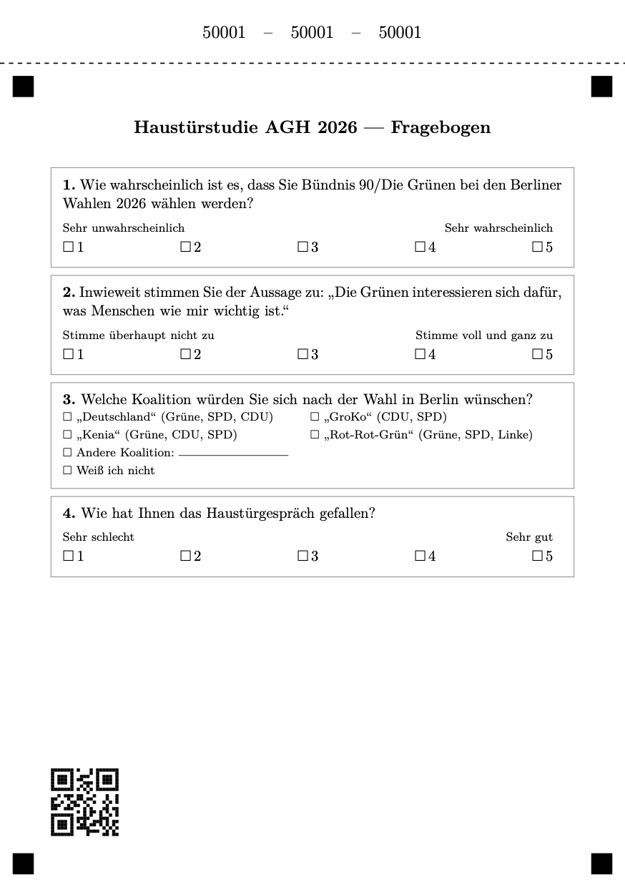

# Kernidee

Wie können wir besonders wirksame Haustürgespräche führen? Die Ergebnisse der vergangenen zwei Haustürstudien in Berlin Mitte haben gezeigt, dass Zuhören offene, respektvolle Gespräche ermöglicht. Allerdings stellt sich die Frage, ob Zuhören allein strategisch und normativ ausreizt, was wir von Haustürgesprächen erwarten können. Wähler:innen erwarten von Parteien zurecht, dass sie ihre Positionen vertreten und begründen. Repräsentation ist keine Einbahnstraße, Austausch und beidseitiges Lernen ist das ideale Ergebnis einer Haustürinteraktion.

Daher testet dieses Feldexperiment, ob *deliberative Gespräche* an der Tür wirksamer sind als aktives Zuhören allein. In deliberativen Gesprächen folgt einem Zuhörblock ein Austausch von Argumenten zu einem von den Wahlkämpfer:innen vorgegebenen Thema. Am Ende der Gespräche fragen wir die Bewohner:innen nach ihrer Wahlabsicht und ihrer Einschätzung der Responsivität der Partei und können so die Wirkung der beiden Gesprächsvarianten vergleichen.

# Die zwei Gesprächsvarianten

Beide Skripte folgen derselben Grundstruktur und unterscheiden sich erst im letzten Schritt:

1. Begrüßung
2. Zuhörgespräch zu Themen der Wähler:in
3. Canvasser nennt Thema und überreicht Postkarte/Flyer mit Position der Partei
4. [Nur deliberativ:] Austausch von Argumenten zu diesem Thema

# Austausch von Argumenten
In den deliberativen Gesprächen nennt die Wahlkämpfer:in das Thema und begründet die Wichtigkeit des Themas. Dieser Grund kann eine persönliche *Anekdote*/Erfahrung ("Ich halte es im Sommer in meiner Dachgeschosswohnung kaum mehr aus"), ein *normatives Argument* ("wir sollten unseren Nachfahren einen lebenswerten Planeten hinterlassen") oder ein *Fakt* ("jedes Jahr sterben zehntausende Menschen in Deutschland an den Folgen von Hitze") sein. 

Daraufhin wird die Wähler:in nach Ihrer Sichtweise und ihren Argumenten gefragt. Bringt die Person ein Gegenargument vor, nimmt die Canvasser\*in es auf, antwortet inhaltlich. In diesem Fall werden sowohl die typischen Zuhörstrategien angewandt, als auch inhaltliche Argumente bemüht. 

Für den (wahrscheinlich häufigeren) Fall, dass die beiden Gesprächspartner:innen sich in der Sache einig sind, konzentriert sich das Gespräch auf die persönlichen Erfahrungen und individuellen Begründungen der Position sowohl der Canvasser:in als auch der Wähler:in. Dabei ist das übergeordnete Ziel, dass am Ende des Gesprächs beide Seiten die Position der anderen Seite nachvollziehen können. Es geht also nicht nur darum zu verstehen, sondern auch darum, sich verständlich zu machen.

# Ablauf an der Tür

Canvasser\*innen werden in beiden Skripten geschult und wenden während einer Session beide an; welches Skript an welcher Tür zum Einsatz kommt, entscheidet der Zufall. Nach dem Gespräch trägt die Canvasser\*in kurze eigene Einschätzungen ein (Tonfall, vermutete Themen); die Bewohner\*innen beantworten selbst und anonym drei Fragen — Wahlabsicht, Einschätzung der Responsivität der Partei, Koalitionspräferenz — und werfen den Zettel direkt in die mitgeführte Urne.

Es gibt vier Szenarien:

| | **Deliberativ** | **Nicht-deliberativ** |
| - | --- | --- |
| **Anonym** | Deliberative Unterhaltung + anonymer Fragebogen (Urne) | Nicht-deliberative Unterhaltung, + anonymer Fragebogen (Urne) |
| **Offen** | Deliberative Unterhaltung + Direktabfrage | Nicht-deliberative Unterhaltung + Direktabfrage |

# Fragebogen

In beiden Fällen endet das Gespräch mit Dank und der Bitte, den Fragebogen auszufüllen. Wir randomisieren, ob dies anonym oder offen geschieht. In der offenen Variante fragt die Wahlkämpfer:in die Fragen direkt ab, in der anonymen Variante füllt die Person einen Mini-Fragebogen aus, der in eine kleine Urnen-artige Box geworfen wird, die die Wahlkämpfer:innen mitführen. So stellen wir sicher, dass die Antwort nicht von sozialer Erwünschtheit beeinflusst wird. 

---

*Fragebogen Entwurf:*

{width=80%}

---

Um die Daten aus dem Fragebogen mit den Daten aus der App zu verknüpfen, ist auf den Fragebögen eine abtrennbare, fünfstellige Nummer aufgedruckt, die einem individuellen, unten-links auf dem Fragebogen aufgedruckten QR-Code zugeordnet werden kann. Die Wahlkämpfer:in trennt diese Nummer ab und trägt sie in der App ein, bevor die Person den Fragebogen ausfüllt. So stellen wir sicher, dass die Antworten gegenüber den Wahlkämpfer:innen anonym bleiben, wir aber im Nachhinein dennoch die Antworten mit den Gesprächsnotizen verknüpfen können.

Die Fragebögen werden dann gefaltet und in die Urne geworfen. Die Wahlkämpfer:in darf **nicht** hineinschauen, um die Anonymität der Antworten zu gewährleisten.

](urnen.png){width=50%}